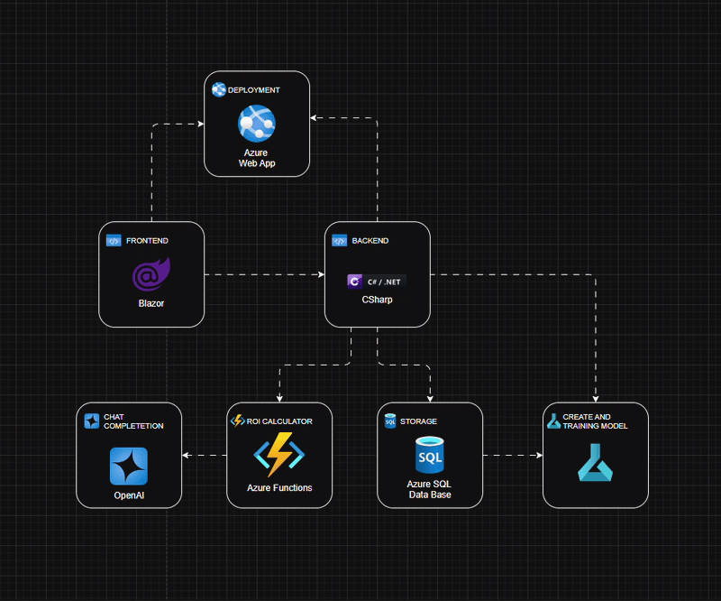

# Microsoft Hackathon ROI Calculator
Quando as empresas precisam se adaptar, a mudança geralmente traz riscos substanciais, e 70% dos projetos de transformação falham. Estamos procurando mudar essa estatística usando IA para permitir que os líderes tomem decisões mais inteligentes. A prontidão para a transformação é fundamental. Se as equipes não estiverem preparadas, as iniciativas enfrentam lançamentos atrasados, desperdício de recursos e funcionários frustrados e desengajados. 

## Desafio 
Construir uma calculadora de ROI para ajudar os líderes a se prepararem para a mudança com insights preditivos, recomendações acionáveis para iniciativas de mudança, visualizações e relatórios. Entradas de amostra incluiriam orçamento do projeto, número de funcionários impactados e duração do projeto. Considere os riscos financeiros de falha do projeto e desengajamento dos funcionários, bem como as economias potenciais de produtividade aumentada, redução de risco e entrega bem-sucedida do projeto.

# Arquitetura de Serviços Azure

## Componentes Principais

### Frontend
- **Blazor**:  
  Responsável pela interface de usuário (UI). Utilizado para:  
  - Entrada de dados e exibição dos resultados de cálculo da calculadora de ROI.  
  - Cadastro de resultados de projetos concluídos para alimentar os modelos de Machine Learning.  
  - Visualização interativa e dinâmica de gráficos, dados de projetos e relatórios personalizados, proporcionando uma experiência rica e intuitiva ao usuário.

### Backend
- **C# / .NET**:  
  Camada responsável por processar a lógica de negócios. Realiza operações CRUD (Create, Read, Update, Delete) no banco de dados Azure SQL, garantindo a integridade e consistência dos dados.

### Banco de Dados
- **Azure SQL Database**:  
  Central de armazenamento de dados da aplicação. Armazena informações sobre projetos, incluindo:
  - **Identificação e Descrição**:  
    - `id`: Chave primária única para cada projeto.  
    - `project_name`: Nome do projeto (obrigatório).  
    - `description`: Descrição detalhada do projeto (opcional).  
  - **Financeiro e Temporal**:  
    - `project_budget`: Orçamento do projeto.  
    - `start_date`: Data de início do projeto.  
    - `project_duration_months`: Duração estimada do projeto em meses.  
    - `roi`: Retorno sobre o investimento calculado.  
  - **Equipe e Impacto**:  
    - `number_of_employees`: Número de funcionários impactados pelo projeto.  
    - `employees_using_new_tool`: Quantidade de funcionários utilizando novas ferramentas introduzidas.
    - `total_hours_worked_weekly`: Total de horas trabalhadas por semana pelos funcionários no projeto.  
    - `completed_training`: Número de treinamentos concluídos pelos funcionários no projeto.  
  - **Métricas de Mundaças**:  
    - `total_change_implementation_time`: Tempo total de implementação de mudanças.  
    - `total_planned_implementation_time`: Tempo planejado para implementação.  
  - **Qualidade e Conformidade**:  
    - `total_processes`: Total de processos envolvidos no projeto.  
    - `compliant_processes`: Número de processos em conformidade.  
  - **Avaliação do Projeto**:  
    - `project_evaluation_total_responses`: Total de respostas na avaliação do projeto.  
    - `project_evaluation_positive_responses`: Número de respostas positivas na avaliação.  
    - `project_evaluation_sum_of_all_scores`: Soma de todas as pontuações da avaliação.  
### Machine Learning
- **Azure Machine Learning**:  
  Consome os dados do Azure SQL Database para treinar modelos preditivos. Esses modelos são utilizados para:
  - Estimar o ROI do projeto e essa infromação é usado para calcular o riscos de projetos.
  
  Os modelos são ajustados dinamicamente conforme novos dados são incorporados, assegurando relevância e precisão contínuas nas previsões.

### Funções Serverless
- **Azure Functions**:  
  Implementa cálculos de ROI em tempo real de forma eficiente e escalável. Além disso, integra-se ao OpenAI para a geração de relatórios personalizados sob demanda.

### Relatórios Personalizados
- **OpenAI**:  
  Utilizado para criar relatórios detalhados e análises interpretativas baseadas nos dados processados, oferecendo insights valiosos aos usuários em linguagem natural.

### Hospedagem
- **Azure Web App**:  
  Plataforma de hospedagem da aplicação web. Garante:
  - Escalabilidade automática
  - Alta disponibilidade
  - Estabilidade do ambiente de produção

## Fluxo Geral
1. O usuário interage com a interface em **Blazor** para inserir dados de cálculo e projetos.
2. O backend em **C# / .NET** processa as informações e realiza operações no **Azure SQL Database**.
3. O **Azure Machine Learning** utiliza os dados armazenados para treinar e ajustar modelos preditivos.
4. O **Azure Functions** calcula o ROI e outros indices em tempo real e aciona o **OpenAI** para gerar relatórios personalizados.
5. Os resultados são exibidos ao usuário na interface **Blazor**, hospedada no **Azure Web App**.

## Benefícios da Arquitetura
- **Escalabilidade**: Uso de serviços Azure como Web App e Functions permite lidar com picos de demanda.
- **Flexibilidade**: Integração com Machine Learning e OpenAI possibilita adaptação a diferentes casos de uso.
- **Eficiência**: Funções serverless reduzem custos operacionais ao executar apenas sob demanda.
- **Manutenção Simplificada**: Banco de dados e hospedagem gerenciados pelo Azure minimizam a necessidade de gerenciamento manual.

## Próximos Passos
- Implementar autenticação e autorização para garantir segurança dos dados.
- Adicionar dados reais de projeto para o treinamento dos modelos de Machine Learning.
- Adicionar testes automatizados para os modelos de Machine Learning.

## Limitaçoes
- Os dados atualmente utilizados são gerados de forma aleatória apenas para fins de teste, apresentando baixa significância estatística e não refletindo cenários reais de uso.

# Cálculo de Retorno sobre Investimento (ROI) para Projetos
O método de calculo do Retorno sobre Investimento (ROI) deste aplicativo, considera fatores como orçamento, impacto nos funcionários, duração, riscos financeiros, produtividade e sucesso na entrega. O objetivo é fornecer uma análise quantitativa que auxilie na avaliação da viabilidade e lucratividade do investimento.

## Entradas
- **Orçamento do projeto**: Valor total alocado para o projeto.
- **Número de funcionários impactados:** Quantidade de colaboradores afetados diretamente pelo projeto.
- **Duração do projeto (em meses):** Período estimado para a execução completa.

## Fatores a Considerar
- **Riscos financeiros de falha:** Perdas potenciais caso o projeto não seja concluído com sucesso.
- **Desengajamento dos funcionários:** Impacto da falta de motivação ou adesão da equipe.
- **Economias por produtividade aumentada:** Ganhos estimados com o aumento da eficiência dos funcionários.
- **Redução de risco:** Benefícios associados à mitigação de incertezas ou falhas. A capacidade técnica e a motivação da equipe mitiga riscos.
- **Entrega bem-sucedida:** Valor agregado pela conclusão do projeto dentro dos objetivos planejados.

## Retorno sobre Investimento (ROI)

O ROI é uma métrica financeira usada para avaliar a eficiência ou lucratividade de um investimento, comparando os benefícios gerados (ganhos ou economias) com o custo do investimento.

### Fórmula do ROI

$$\text{ROI \%)} = \left[\frac{\text{Benefícios Totais} - \text{Investimento Total}}{\text{Investimento Total}}\right] \times 100$$

#### Onde:
- **Benefícios Totais**: Soma das economias projetadas (aumento de produtividade, redução de riscos e sucesso do projeto).
- **Investimento Total**: Custo total do projeto, incluindo orçamento, mitigação de riscos e outros gastos relacionados.

### Componentes dos Cálculos

#### 1. Custo Médio Mensal por Funcionário
$$
\text{Custo Médio} = \frac{\text{Orçamento}}{\text{Número de Funcionários} \times \text{Duração (meses)}}
$$

#### Onde:
- **Orçamento**: Valor total do projeto em reais.
- **Número de Funcionários**: Total de colaboradores impactados.
- **Duração (meses)**: Tempo estimado do projeto.

#### 2. Economia por Produtividade Aumentada

$$
\text{Ganho de Produtividade} = (\text{Custo Médio} \times (\text{Ganho Esperado} - 1)) \times \text{Número de Funcionários} \times \text{Duração (meses)}
$$

$$
\text{Ganho Ajustado} = \text{Ganho de Produtividade} \times (1 - \text{Taxa de Desengajamento})
$$

##### Onde:
- **Custo Médio**: Custo médio mensal por funcionário (calculado acima).
- **Ganho Esperado**: Fator de aumento de produtividade (ex.: 1,2 para 20%).
- **Taxa de Desengajamento**: Percentual de perda por desengajamento (ex.: 0,1 para 10%).

#### 3. Redução de Risco
$$
\text{Redução de Risco} = (\text{Orçamento} \times \text{Taxa de Perda}) \times \text{Redução Projetada}
$$

$$
\text{Redução Ajustada} = \text{Redução de Risco} \times (1 - \text{Taxa de Falha})
$$

##### Onde:
- **Orçamento**: Valor total do projeto em reais.
- **Taxa de Perda**: Percentual do orçamento perdido em caso de falha (ex.: 0,3 para 30%).
- **Redução Projetada**: Percentual de risco mitigado (ex.: 0,5 para 50%).
- **Taxa de Falha**: Probabilidade de falha do projeto (ex.: 0,7 para 70%).

#### 4. Benefício de Sucesso
$$
\text{Benefícios de Sucesso} = \text{Orçamento} \times \text{Fator de Sucesso}
$$

$$
\text{Benefícios Ajustados} = \text{Benefícios de Sucesso} \times (1 - \text{Taxa de Falha})
$$

##### Onde:
- **Orçamento**: Valor total do projeto em reais.
- **Fator de Sucesso**: Multiplicador de benefícios adicionais (ex.: 0,4 para 40%).
- **Taxa de Falha**: Probabilidade de falha do projeto (ex.: 0,7 para 70%).

#### Soma dos Benefícios Ajustados
$$
\text{Benefícios Totais} = \text{Ganho Ajustado} + \text{Redução Ajustada} + \text{Benefícios Ajustados}
$$

##### Onde:
- **Ganho Ajustado**: Economia por produtividade ajustada.
- **Redução Ajustada**: Redução de risco ajustada.
- **Benefícios Ajustados**: Benefícios de sucesso ajustados.
