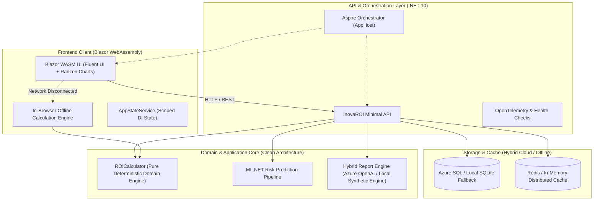

# InovaROI - Enterprise Transformation ROI & Risk Prediction Platform

[](https://dotnet.microsoft.com/)
[](https://dotnet.microsoft.com/apps/aspnet/web-apps/blazor)
[](https://learn.microsoft.com/dotnet/aspire/)
[](https://dotnet.microsoft.com/apps/machinelearning-ai/ml-dotnet)
[](https://azure.microsoft.com/products/ai-services/openai-service)
[](LICENSE)
[](microsoft-hackathon-roi-calculator.Tests)

> **Executive Overview**: Over 70% of organizational transformation initiatives fail due to miscalculated risks, employee disengagement, and cost overruns. **InovaROI** bridges the gap between raw financial metrics and executive decision-making by combining **pure deterministic financial modeling**, **machine learning risk forecasting**, and **generative AI narrative synthesis** into a cohesive enterprise solution.

---

## Authorship & Hackathon Origins

This project was originally designed and built for the **Microsoft Innovation Challenge Hackathon (March 2025)** by:

| Engineer | GitHub | Core Focus |
| :--- | :--- | :--- |
| **Adriano Godoy** | [@led-21](https://github.com/led-21) | Solution Architecture, Backend Engine, Distributed Services, Cloud Resilience |
| **Danillo Silva** | [@DanilloAraujo](https://github.com/DanilloAraujo) | Frontend Experience (Blazor / Fluent UI), Data Visualizations, UX Integration |

### What this project demonstrates:
- **High-Velocity Teamwork**: Architecting and delivering a functional, multi-tier enterprise solution under intensive hackathon time constraints.
- **Enterprise Engineering Principles**: Evolving an agile hackathon prototype into a resilient, production-ready portfolio case using **.NET 10 LTS**, Clean Architecture, and **100% offline fallback capabilities**.
- **Modern Microsoft Technology Stack**: Seamless cross-cutting integration of **Blazor WebAssembly**, **.NET Aspire**, **ML.NET**, **Azure OpenAI**, **Entity Framework Core**, and **Fluent UI**.

---

## Key Architectural Highlights


```mermaid
flowchart TD
    subgraph ClientLayer["Frontend Client (Blazor WebAssembly)"]
        UI["Blazor WASM UI (Fluent UI + Radzen Charts)"]
        WasmFallback["In-Browser Offline Calculation Engine"]
        State["AppStateService (Scoped DI State)"]
    end

    subgraph ApiLayer["API & Orchestration Layer (.NET 10)"]
        Aspire["Aspire Orchestrator (AppHost)"]
        Api["InovaROI Minimal API"]
        ServiceDefaults["OpenTelemetry & Health Checks"]
    end

    subgraph CoreLayer["Domain & Application Core (Clean Architecture)"]
        FinEngine["ROICalculator (Pure Deterministic Domain Engine)"]
        MLModel["ML.NET Risk Prediction Pipeline"]
        AIService["Hybrid Report Engine (Azure OpenAI / Local Synthetic Engine)"]
    end

    subgraph DataLayer["Storage & Cache (Hybrid Cloud / Offline)"]
        SQL[("Azure SQL / Local SQLite Fallback")]
        Cache[("Redis / In-Memory Distributed Cache")]
    end

    UI -->|HTTP / REST| Api
    UI -.->|Network Disconnected| WasmFallback
    WasmFallback --> FinEngine
    Api --> FinEngine
    Api --> MLModel
    Api --> AIService
    Api --> SQL
    Api --> Cache
    Aspire -.-> Api
    Aspire -.-> UI
```

### 1. Pure Deterministic Financial Engine (`Domain.Financial`)
Financial math is strictly isolated from presentation, framework code, and external I/O:
- Immutable domain models (`FinancialModel`, `FinancialInputs`, `RiskParameters`).
- Pure functional calculations with zero side-effects.
- Solves for **Net Benefit**, **Benefit-Cost Ratio (BCR)**, and **Break-Even Failure Rate**.
- Covered by comprehensive unit tests with strict boundary validations.

### 2. Machine Learning vs. Generative AI (Clear Boundaries)
- **Predictive Analytics (ML.NET)**: Predicts project failure probability based on empirical regression against team scale, duration, and budget. Features domain-informed fallback bounds when training data is sparse.
- **Generative AI (Azure OpenAI GPT-4o)**: Translates quantitative financial outputs and risk scores into actionable, C-level executive briefs and change-management roadmaps.

### 3. 100% Offline Capability (Zero Cloud Lock-in)
The application runs locally without any cloud subscription, API key, or active network connection:
- **Persistence**: Automatically switches between Azure SQL Database / SQL Server container and a lightweight local **SQLite** (`roidb.db`) database.
- **Distributed Cache**: Gracefully falls back from Redis to an **in-memory distributed cache**.
- **Executive AI Reporting**: When Azure OpenAI endpoints or keys are omitted, the built-in **`LocalTemplateReportService`** produces structured, deterministic executive analysis locally.
- **Frontend Autonomy**: If the backend API service is offline, Blazor WASM executes the domain calculations in-browser directly via compiled WebAssembly.

---

## Financial Methodology & Formulas

The platform evaluates transformation initiatives across four interconnected economic vectors:

```
ROI (%) = [(Total Adjusted Benefits - Total Investment) / Total Investment] * 100
```

### 1. Average Monthly Employee Cost
$$\text{Cost}_{\text{employee}} = \frac{\text{Budget}}{\text{Employees} \times \text{Duration (months)}}$$

### 2. Productivity Gains (Adjusted for Disengagement)
$$\text{Productivity Gain} = (\text{Cost}_{\text{employee}} \times (\text{Gain Multiplier} - 1)) \times \text{Employees} \times \text{Duration}$$
$$\text{Adjusted Productivity} = \text{Productivity Gain} \times (1 - \text{Disengagement Rate})$$

### 3. Risk Mitigation Benefits
$$\text{Risk Reduction} = (\text{Budget} \times \text{Loss Rate}) \times \text{Projected Risk Reduction}$$
$$\text{Adjusted Risk Reduction} = \text{Risk Reduction} \times (1 - \text{Failure Probability})$$

### 4. Successful Delivery Benefit
$$\text{Success Benefit} = \text{Budget} \times \text{Success Multiplier}$$
$$\text{Adjusted Success Benefit} = \text{Success Benefit} \times (1 - \text{Failure Probability})$$

### 5. Break-Even Failure Rate
The critical threshold where project benefits equal costs ($\text{ROI} = 0\%$):
$$\text{Failure Rate}_{\text{break-even}} = 1 - \frac{\text{Budget} - \text{Adjusted Productivity}}{\text{Risk Reduction} + \text{Success Benefit}}$$

---

## Solution Structure

```
microsoft-hackathon-roi-calculator/
├── .github/workflows/                 # CI/CD (GitHub Actions)
│   ├── ci.yml                         # Automated build & unit test pipeline
│   └── azure-static-web-apps-*.yml    # Static Web Apps deployment workflow
├── docs/                              # Architecture diagrams & design artifacts
├── microsoft-hackathon-roi-calculator.Domain/
│   ├── Financial/                     # Pure financial & risk calculation engine
│   └── Models/                        # Domain entities & shared contracts
├── microsoft-hackathon-roi-calculator.Application/
│   ├── Configuration/                 # Strongly-typed options (AzureOpenAIOptions)
│   ├── Interfaces/                    # IROICalculatorService, IAssistantReportService
│   ├── Services/                      # AzureOpenAIReportService, LocalTemplateReportService
│   └── UseCases/                      # Core business use cases & ML estimators
├── microsoft-hackathon-roi-calculator.Persistence/
│   └── Data/                          # CalculatorDbContext (EF Core SQL Server / SQLite)
├── microsoft-hackathon-roi-calculator.Api/
│   ├── Endpoints/                     # Minimal API endpoints (/api/roi/...)
│   └── Program.cs                     # API bootstrapper with hybrid cloud/local DI
├── microsoft-hackathon-roi-calculator.Web/
│   ├── Pages/                         # Blazor WASM pages (Calculator, Dashboard, Projects, Report)
│   └── Services/                      # AppStateService, RoiApiClient, MarkdownService
├── microsoft-hackathon-roi-calculator.AppHost/ # .NET Aspire distributed orchestrator
├── microsoft-hackathon-roi-calculator.ServiceDefaults/ # Telemetry, health checks, discovery
├── microsoft-hackathon-roi-calculator.Functions/ # Serverless calculation worker
└── microsoft-hackathon-roi-calculator.Tests/   # Unit & regression test suite (xUnit)
```

---

## Security Audit & Credential Hygiene

As part of transforming this hackathon project into an enterprise portfolio case:
- **Credential Revocation**: Pre-release hackathon Azure OpenAI endpoints and API keys previously committed in git history were permanently revoked in the Azure Portal.
- **Zero Committed Secrets**: All configuration is read via environment variables, `appsettings.json`, and `.env` files.
- **Template Configuration**: A sanitized [`.env.example`](file:///.env.example) is provided for configuring local or cloud environments.

---

## Quickstart & Local Execution

### Prerequisites
- [.NET 10 SDK](https://dotnet.microsoft.com/download/dotnet/10.0) (or [.NET 9 / 8](https://dotnet.microsoft.com/download) compatible)
- *Optional*: Docker Desktop (only if running SQL Server / Redis / Ollama via Aspire)

### 1. Clone & Run Automated Tests
```bash
git clone https://github.com/led-21/microsoft-hackathon-roi-calculator.git
cd microsoft-hackathon-roi-calculator

# Run all unit tests
dotnet test --filter "Category!=Integration"
```

### 2. Run in Standalone Local Mode (Zero Configuration)
The system runs immediately out-of-the-box using local SQLite, in-memory cache, and local AI synthesis:

**Terminal 1 (Backend API):**
```bash
cd microsoft-hackathon-roi-calculator.Api
dotnet run
# API running at https://localhost:7288 | Swagger at https://localhost:7288/swagger
```

**Terminal 2 (Blazor WebAssembly Frontend):**
```bash
cd microsoft-hackathon-roi-calculator.Web
dotnet run
# Frontend running at https://localhost:7197
```

### 3. Run with .NET Aspire (Full Distributed Experience)
To run with unified telemetry, dashboards, and distributed orchestration:
```bash
cd microsoft-hackathon-roi-calculator.AppHost
dotnet run
```
Navigate to the Aspire dashboard URL printed in the console to inspect logs, traces, metrics, and connected services.

---

## Evolution: Hackathon Prototype vs. Portfolio Standard

| Dimension | Hackathon Prototype (March 2025) | Portfolio Edition (.NET 10) |
| :--- | :--- | :--- |
| **Target Framework** | .NET 8 / 9 mixed versions | **.NET 10 LTS Unified** across all projects |
| **Financial Engine** | Coupled inline procedural logic | **Pure Functional Domain Engine (`ROICalculator`)** |
| **Test Coverage** | 1 sample Aspire test | **36 Comprehensive Unit Tests** (100% pass rate) |
| **Cloud Dependency** | Required active Azure SQL & Azure OpenAI | **100% Offline Capability** (SQLite + In-Memory + Local Engine) |
| **Frontend State** | Unsafe static shared variables | **Scoped DI State Management (`AppStateService`)** |
| **Resilience** | Failed without internet connection | **Graceful In-Browser WebAssembly Fallback** |
| **CI/CD** | Single deployment workflow | **Automated GitHub Actions CI Pipeline** (build + test) |

---

## License

This project is licensed under the MIT License - see the [LICENSE](LICENSE) file for details.
